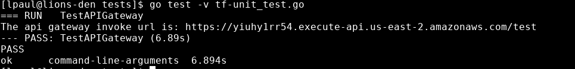
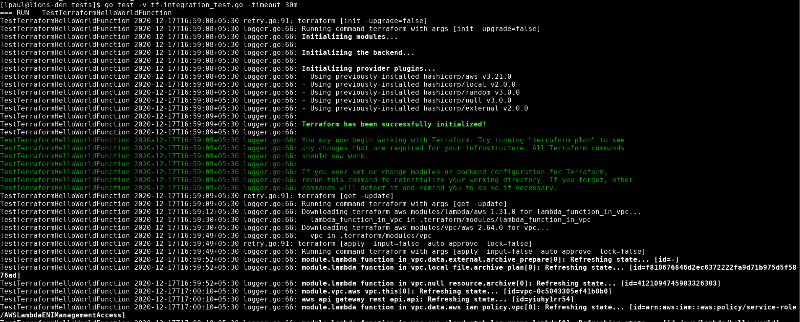
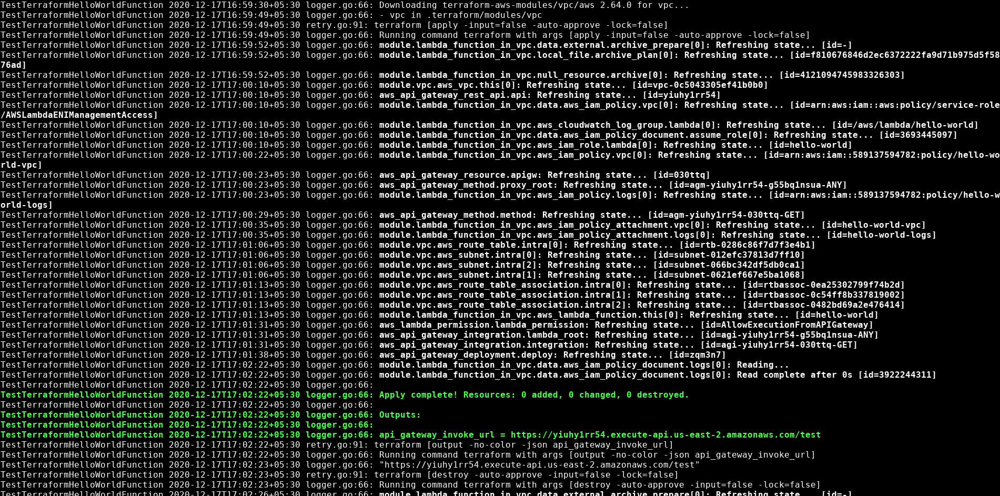
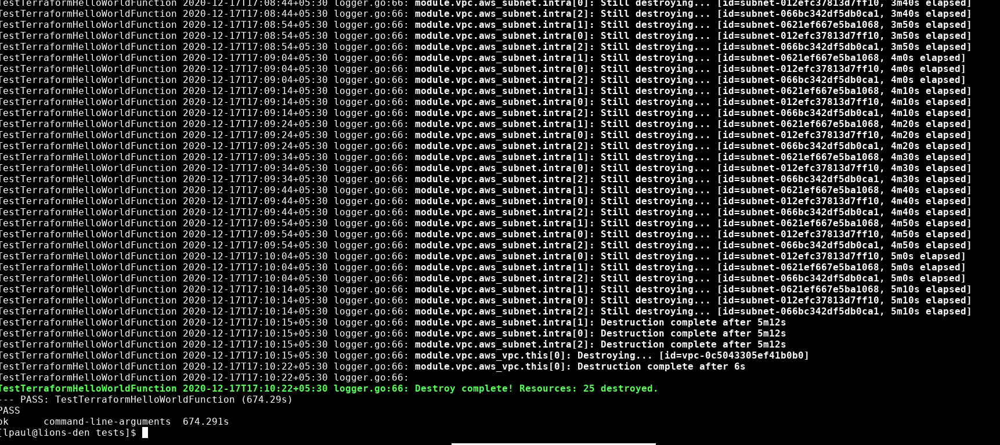
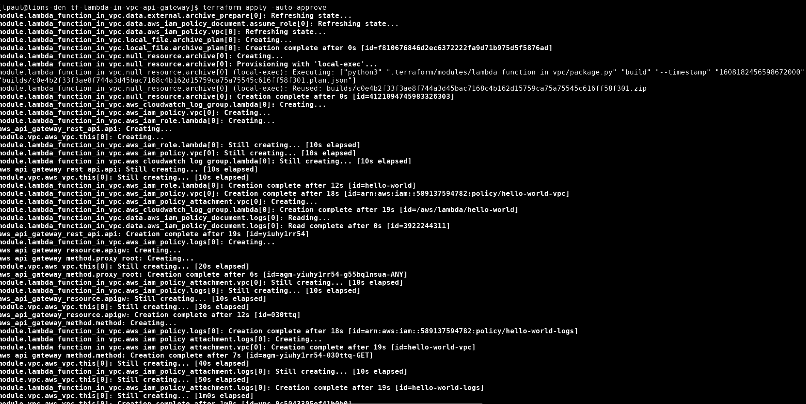
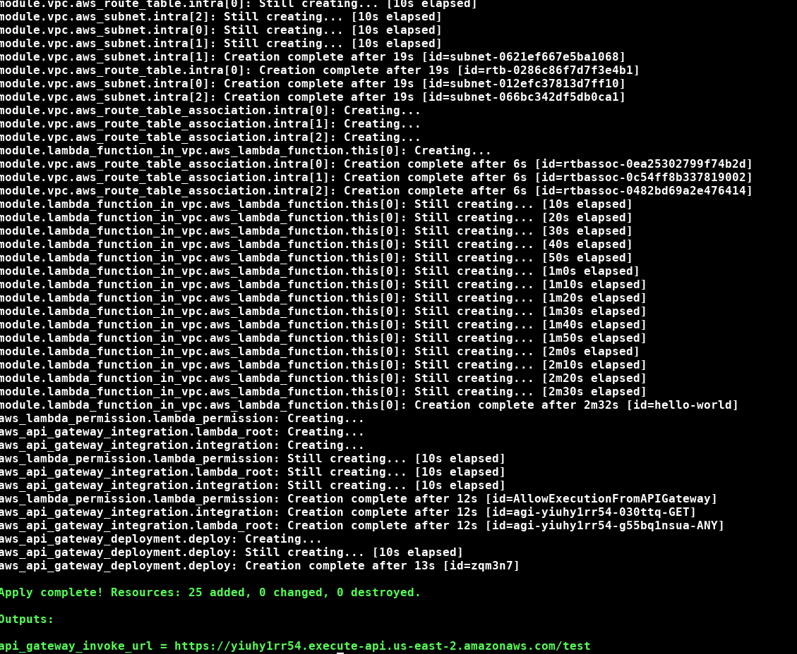

## Task ##

Terraform config for launching the following:

I.  A lambda on vpc with a simple helloworld.js - inline zip file for code, no s3 dependencies.

II. API gateway frontending the lambda

And then, add couple testcases in the scripting language of your choice to verify the resources from step I and II.

## Tests

Integration test makes uses of Terratest Go library. 

`
go test -v tf-integration_test.go -timeout 30m
`

#### Gotchas ####

Go’s package testing has a default timeout of 10 minutes, after which it forcibly kills your tests—even your
cleanup code won’t run! It’s not uncommon for integration tests to take longer than 10 minutes, so you’ll
almost always want to increase the timeout by using the -timeout option as shown above.

## Sample Run ##

